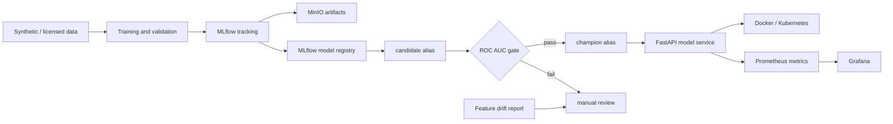

# Platform architecture and boundaries

This repository provides the **application-side** MLOps foundation. It is not a claim that every production platform can be installed with one command; high-cost or cluster-heavy systems are introduced only after the core workflow is understood.

| Layer | Local component | Purpose | Portfolio evidence |
| --- | --- | --- | --- |
| Experiment tracking | MLflow + PostgreSQL | parameters, metrics, model history | comparable MLflow runs |
| Artifact store | MinIO | model and experiment artifacts | versioned model artifact |
| Serving | FastAPI + Docker | validated prediction API | OpenAPI page and container |
| Deployment | kind + Kubernetes | repeatable local rollout | manifest and readiness probe |
| Observability | Prometheus + Grafana | platform monitoring starting point | local dashboards |
| Automation | GitHub Actions | linting, tests, portfolio-link check | green CI badge |



## Model lifecycle

The training module logs the fitted pipeline as an MLflow model. Set `MLFLOW_REGISTER_MODEL=true` to register that run under the `candidate` alias. Promotion is a separate command with a visible validation gate:

```powershell
python -m churn_service.registry --promote --minimum-roc-auc 0.70
```

The command moves the `champion` alias only when the candidate run contains a qualifying ROC AUC value. It does not retrain or deploy automatically.

## Drift monitoring

Generate a deterministic report with:

```powershell
python -m churn_service.monitoring --output reports/drift-report.json
python -m churn_service.monitoring --simulate-shift --output reports/drift-simulation.json
```

Numeric features use population stability index; categorical features use total-variation distance. Thresholds are explicit in the report and should be calibrated with real, licensed production data before operational use.

## What comes next

After all three examples run locally, add one capability at a time:

1. DVC with a remote store for real dataset versions.
2. Add approval records and deployment manifests tied to the MLflow champion alias.
3. Add request-latency and input-quality dashboards using the exposed Prometheus endpoint.
4. Calibrate drift thresholds with a licensed dataset before automated retraining.
5. Add Prefect or Kubeflow only when local scripts become hard to coordinate.
6. Add KServe only after the Kubernetes workflow is stable.

This staged approach mirrors a full MLOps platform without hiding the fundamentals under too much infrastructure.

